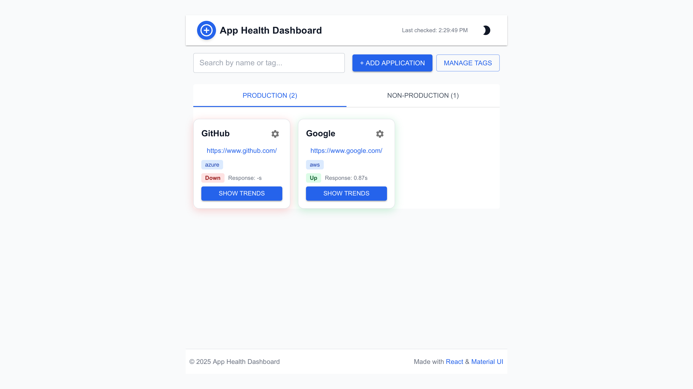
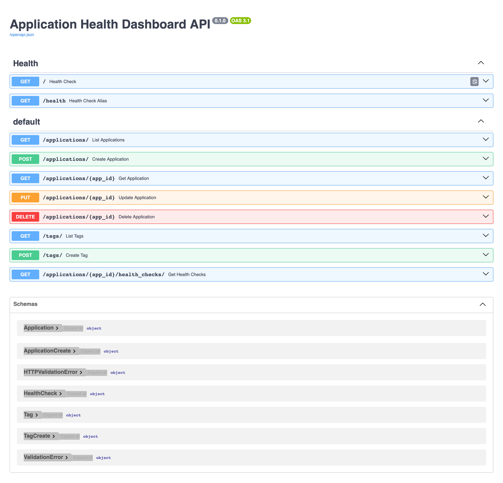

# App Health Dashboard

## Features
- Monitor application health (up/down, response time)
- Add, edit, delete applications and tags
- View trends for each application
- Responsive UI with dark mode
- **Edit/Delete**: Use the gear icon on each card for edit/delete actions
- **Production/Non-Production**: Now separated by tabs, not shown on cards
- **Status**: Card shadow and badge color indicate up (green) or down (red)
- **Edge Browser**: Overlay styling improved for better visibility

## Screenshots

### Frontend

### Backend

## Backend
- Health endpoints (`/` and `/health`) are now in `src/backend/health.py`
- Health worker runs automatically with backend (no separate process needed)

## Setup
- See [docs/front-end-setup.md](docs/front-end-setup.md) for frontend setup
- See [docs/backend-setup.md](docs/backend-setup.md) for backend setup
- See [docs/docker-usage.md](docs/docker-usage.md) for Docker usage

## Notes
- If you see "No checks yet", wait 1 minute for the health worker to run
- For Edge browser, overlays and shadows are styled for clarity 